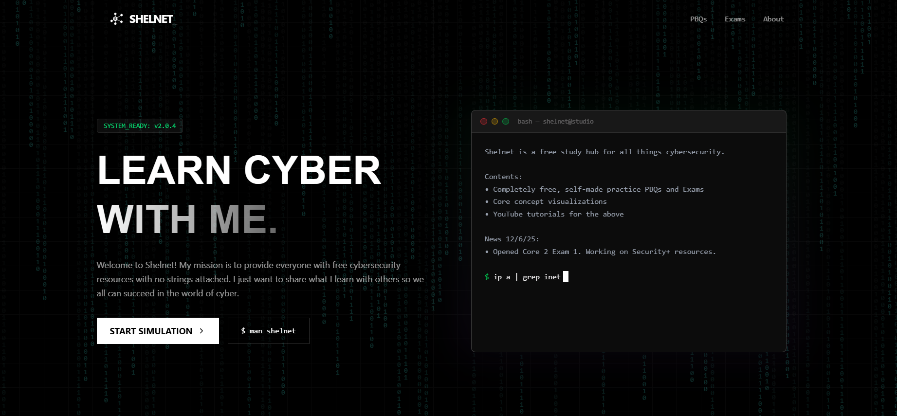
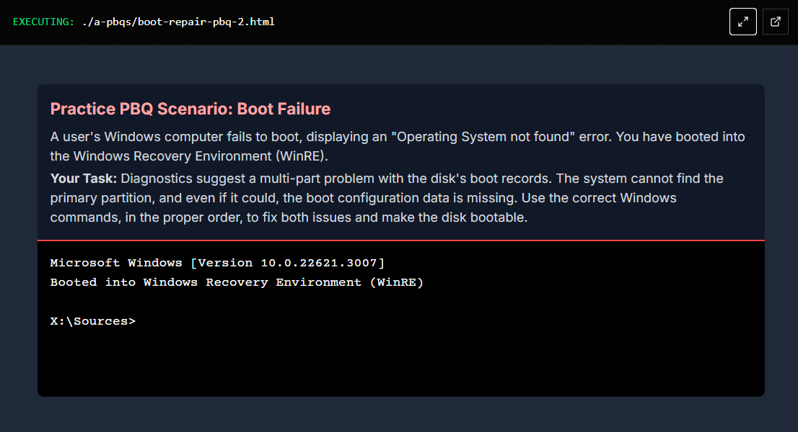
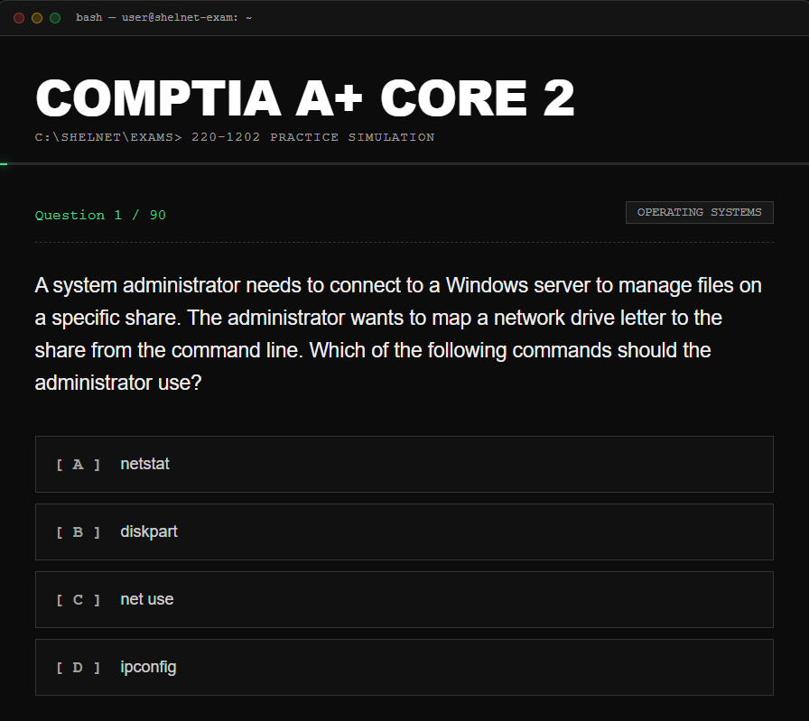

# Shelnet

**Core:** To learn cybersecurity and share my entire journey, completely for free. 

## What is Shelnet?

Shelnet is a dedicated hub for cybersecurity educational resources, built by a university student who believes that educational resources should be free and accessible and that one of the best ways to learn is through teaching others.

Currently, the site provides comprehensive resources for **CompTIA A+** and **Security+**, but the roadmap is expanding. Future updates will encompass **CTF walkthroughs**, **concept visualizations**, and more.

Shelnet is built on a simple promise: **Always free, no data collection.** There are no logins, no paywalls, and no tracking—just accessible knowledge for everyone.

## Key Features

### 1. Free Performance Based Questions (PBQs)
Shelnet offers interactive simulations designed to real CompTIA exams, preparing students for the practical components of their certification exams. Disclaimer: not taken from CompTIA directly. The PBQs were conceived by reading the Exam Objectives and deciphering which topics could be interactive.

* **CompTIA A+ (220-1202):** Hands-on scenarios including hardware troubleshooting, printer configuration, and network setup.
* **Security+ (SY0-701):** Advanced simulations covering firewall logs, vulnerability scanning analysis, and secure network architecture.

### 2. Free Full-Length Mock Exams
90-question simulated exams that mirror the structure of the actual tests. These exams cover all major domains: Disclaimer: not taken from CompTIA directly. The exams were conceived by reading the Exam Objectives and deriving scenario-based questions per topic & sub-topic.

* **Operating Systems & Security**
* **Software Troubleshooting**
* **Threats, Vulnerabilities, & Mitigations**
* **Security Operations & Architecture**

### 3. Expanding Resource Library
Shelnet is an evolving project with a growing roadmap of educational content. Upcoming features include:

* **CTF Walkthroughs:** Step-by-step guides for Capture The Flag challenges.
* **Concept Visualizations:** Interactive diagrams to explain complex networking and security topics.
* **Video Tutorials:** Integrated YouTube explanations for key concepts.

## Privacy & Philosophy

> If a product is free, you are the product.

Shelnet is different:
* **Client-Side Only:** The entire app runs in your browser.
* **Zero Tracking:** We collect 0.00 MB of data.
* **Open Source:** You can audit the code yourself.

## Connect

* [Shelnet](https://youtube.com/@Shelnet)
* [LinkedIn](https://linkedin.com/in/luigi-fernandez-502647333)
* [Email](https://forms.gle/WRM23ktXNZiupPaZA)

---

  <small>&copy; 2025 Shelnet Org.</small>

